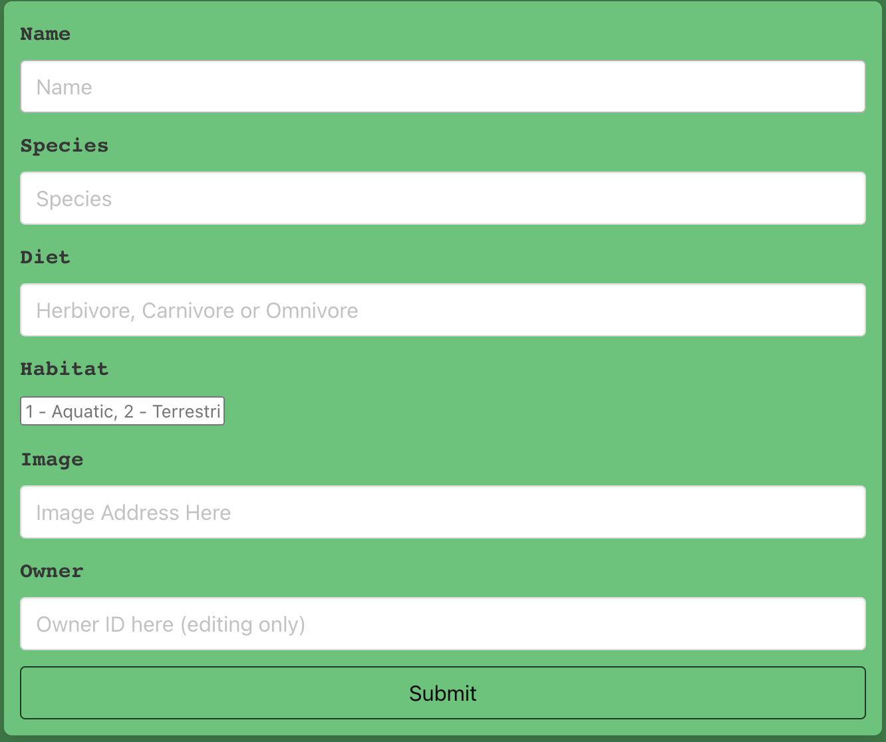
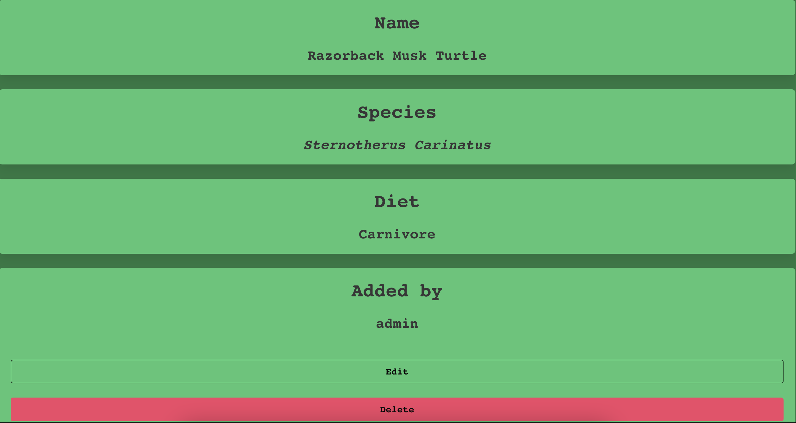

# Shellbook, a Python Django API and React app - GA Project 4

## Deployment

### Shellbook has been deployed with Heroku, and is available [here](http://shellbook.herokuapp.com/)

Shellbook is my final project for the Software Engineering Immersive course at GA. It is a full-stack application featuring multiple relationships and is built with Django REST Framework & React. 

Shellbook is a community page for lovers of turtles, terrapins and tortoises. Where users can acquire information about these various animals, leave comments and upload their own. 


## Brief & Timeframe

- Build a full-stack application using a backend and frontend of your own creation.
- Use Python, Django & Django REST Framework to create an API, and serve your data from a Postgres database.
- Consume your API with a frontend built seperately using React.
- Must be a full product, meaning it features multiple relationships and CRUD functionality. 
- Implementation of a thoughtful user story.
- Visually impressive design. 
- Must be deployed online, so it is publically accessible. 
- Write DRY code and build RESTful API's.
- 8 day timeframe. 

## Technologies Used

- Django 
- Django REST Framework
- PostgreSQL
- PyJWT
- JavaScript
- React.js
- HTML
- CSS
- Axios
- Bulma
- Git
- GitHub
- React-router-dom
- Insomnia 
- Tableplus

## Starting Off

Source code was provided by GA, and the following commands were input into the terminal.

- <!— To install all the dependencies listed in the package.json: —> $ yarn 
- <!- Navigate into the shell -> $ pipenv shell
- <!— Run the app on localhost:8000 : —> $ python manage.py runserver
- <!— Check the console for any issues and if there are any then check the package.json for any dependencies missing —>
- <!- Navigate to http://localhost:8000/>

## Demonstration of the App Flow

### Shellbook Main Page.


### Users must register before being granted full functionality of the site.


### Users may then login.


### Logged in users may view their profile page, where any submitted turtles and comments are visible.


### Users may create new turtles to be added to the main page.



### A created turtle will now be visible 



### Users may comment on turtles


## Functionality

Like similar fan sites, users of Shellbook can:

- Register & Login
- View their profile page
- Add animals to the main page
- View animals on the main page
- View animals on the show page
- Comment on animals on the show page 
- Update & Delete animals

## Process

The process by which I developed this app started with planning. My initial step was to plan the relationships required for the app, illustrated below in the Entity Relationship Diagram.


Once I was satisfied with the ERD, I moved onto creating hand-drawn wireframes for the frontend. This is a step in hindsight I wish I did digitally, and will move onto digital wireframing for future projects.

To establish the RESTful features of Shellbook, I started development by building my models, views and serializers in Django REST Framework to create a SQL database. This process took a couple of days as I wanted to ensure everything was working as intended. To visualise my PostgreSQL database, I utilized tableplus as well as the Insomnia REST client to test my backend requests. This way I ensured my relationships between models were correct based off of the JSON responses I received. 

By day 3 I was pleased with the current state of the backend and opted to shift my focus to the frontend. I installed the CSS framework Bulma as I have previous experience with the framework and appreciate its simplicity in styling in the interest of saving time. Using React and React-router-dom, I created the appropriate pages for Shellbook: home, mainpage, showpage, register, login and profile. 

By day 4, I realised my initial desire for what I wanted Shellbook to be was too broad for the timeframe I had, I wanted the app initially to be for prospective pet owners to communicate with one another and share their pets on a community based page, where users who were interested in certain species of turtle could message owners of a particular species to gain more information/find out if that species was right for them. While I plan to incorporate these features in future iterations of Shellbook, it was too much for the scope of this project, and therefore I decided to finetune the features I had created so far and style them for submission in 4 days.

The remaining 4 days were composed of creating the appropriate Axios requests to display data from the backend on the frontend, linking the various pages together using React-router-dom, ensuring unregistered users could view the main Shellbook page but not have access to the RESTful features of the app until they registered, users who added turtles should see their name on the turtleshow page, as well as edit and delete buttons. Users should also be able to leave comments on created turtles, where the name of the commentor is displayed above the comment itself.

## Styling

As time was of the essence during this project, the Bulma CSS framework proved to be very useful in creating a simple, yet elegant design to Shellbook. I opted for contrasting dark and light greens to complement the 'turtley' nature of the app, combined with some sans-serif font options and a series of curved boxes to produce the final product.

## Featured Code

The following code snippet highlights how I populated the comments section on the turtle page with the name of the owner of the comment as well as the comment itself. Also known as a many-to-one relationship. 

```Python
from comments.serializers.populated import PopulatedCommentSerializer
from habitats.serializers.common import HabitatSerializer
from jwt_auth.serializers.nested import NestedUserSerializer
from ..serializers.common import TurtleSerializer

class PopulatedTurtleSerializer(TurtleSerializer):
    
    comments = PopulatedCommentSerializer(many=True)
    habitat = HabitatSerializer()
    owner = NestedUserSerializer()
    
```

The following code snippet highlights the turtle show page. Notice the createComment api call within the handleSubmit lifecycle function, and notice the map array method to retrieve the user ID and comment data for the turtle being displayed. 

```JavaScript
import React, { Component } from 'react'
import { Link } from 'react-router-dom'
import { deleteTurtle, getSingleTurtle, createComment } from '../../lib/api'

class TurtleShow extends Component {

  state = {
    formData: {
      text: ''
    },
    turtle: null
  }

  async componentDidMount() {
    // request single turtle
    const turtleId = this.props.match.params.id
    const response = await getSingleTurtle(turtleId)
    this.setState({
      turtle: response.data
    })
  }

  handleChange = event => {
    const formData = {
      text: event.target.value
    } 
    this.setState({
      formData: formData
    })
  } 

  handleSubmit = async () => {
    const turtleId = this.props.match.params.id
    this.state.formData.turtle = turtleId
    await createComment(this.state.formData)
    const response = await getSingleTurtle(turtleId)
    this.setState({
      turtle: response.data,
      formData: {
        text: ''
      }
    })
  }


  handleDelete = async () => {
    const turtleId = this.props.match.params.id
    await deleteTurtle(turtleId)
    this.props.history.push('/turtles')
  }

  render() {
    const { turtle } = this.state
    if ( !turtle ) return null
    return (
      <section className="section has-background-success-dark">
        <div className="container">
          <div className="box has-background-success">
            <figure className="image ">
              
            </figure>
          </div>
          <div className="has-text-center has-background-success box">
            <h4 className="title is-3 has-text-centered">
              Name
            </h4>
            <h5 className="title is-4 has-text-centered">{turtle.name}</h5>
          </div>
          <div className="has-text-center has-background-success box">
            <h4 className="title is-3 has-text-centered">
              Species
            </h4>
            <h5 className="title is-4 has-text-centered is-italic">{turtle.species}</h5>
          </div>
          <div className="has-text-center has-background-success box">
            <h4 className="title is-3 has-text-centered">
              Diet
            </h4>
            <h5 className="title is-4 has-text-centered">{turtle.diet}</h5>
          </div>
          <div className="has-text-center has-background-success box">
            <h4 className="title is-3 has-text-centered">
              Added by 
            </h4>
            <div>
              <h5 className="title is-4 has-text-centered">
                {turtle.owner.username}
              </h5>
              <br />
              <h5>
                <Link to={`/turtles/${turtle.id}/edit`} className="button is-fullwidth is-warning is-success is-inverted is-outlined has-text-black"><strong>Edit</strong></Link>
                <br />
                <button onClick={this.handleDelete} className="button is-fullwidth is-danger has-text-black"><strong>Delete</strong></button>
              </h5>
            </div>
          </div>
          <div className="column has-text-center has-background-success box">
            <h4 className="title is-3 has-text-centered">
              Comments
            </h4>
            {turtle.comments.map(comment => (
              <div className="column is-outlined" key={comment.id}>
                <h5 className="title is-4 has-text-centered">{comment.owner.username} says:</h5>
                <h6 className="title is-5 has-text-centered">{comment.text}</h6>
                <hr className="has-background-black" />
              </div>
            ))}
            <textarea className="textarea is-half is-outlined is-black" value={this.state.formData.text} onChange={this.handleChange}></textarea>
            <br />
            <button type="submit" onClick={this.handleSubmit} className="button is-fullwidth is-warning is-success is-inverted is-outlined has-text-black"><strong>Submit</strong></button>
          </div>
        </div>
      </section>
    )
  }


}

export default TurtleShow
```

## Bugs

- After deployment there is an error with registration of new users.
- Logo for Shellbook does not render properly.

## Wins

- Seeing the final product function locally fully styled was hugely satisfying. There is quite no feeling like completing a project after days of hardwork. 

- The comments displaying properly on the turtle show page, with correct user ID's and orientation was very pleasing as I spent a long time struggling with that section of the app.

- Going back and recognising where there was an issue in the backend and correcting it gave me the sense that I am improving as a developer as I can recognise my mistakes and find solutions for myself.

- Testing lines of new code to ensure they work before moving on is a habit I am consciously trying to develop and having this project to practise this was very satisfying.

## Challenges

- Getting the SQL relationships to populate the comment information on the turtle show page was a brutal challenge, which a coach assisted me with to finally understand and solve. Getting the profile page to display the desired information as well proved to be challenging but also had a similar solution to the comments problem before it. 

- Within my API there was some data that would not render or display properly, so much time was spent going back and fixing the URLs for data that I could have easily replaced or deleted and saved time in the long run.

- Even though I have previous experience with Bulma, there were some styling aspects that proved to be too limited with Bulma, for example, the colouring of the page and boxes, in future where I have more time to dedicate to styling I will utilize either a more comprehensive framework like Bootstrap or no framework altogether and style entirely with CSS/SASS.

## Future Features

- Messaging other users.

- More detailed information regarding the domestic upkeep of each animal species. 

- On the profile pages of users, a section for them to view all their comments on turtles, with links to those turtles.

- Favourite/like button.

- Better, more modern styling.

- More refined implementation of the Habitats feature.

- More refined implementation of the filtering/search functionality.

## Key Learning

Opting to produce this application entirely solo was a very rewarding experience, as it meant I had to solve each problem I faced on my own and that was vital for my learning. Boosting my overall confidence in development. 

Time management was certainly a key element to developing Shellbook, there were some days where I would spend hours on just one aspect of the app and I must recognise when this is happening in order to prioritise more important features of the app and learn to come back to the smaller hurdles when the time is more appropriate. 

Re-evaluating my scope for the app in the middle of development was a very humbling experience. In future I will ensure I plan and start out with a smaller project in mind and build up from there if the time permits, rather than starting the other way round and feeling overwhelmed before deciding the smart thing to do is to reduce features and perfect what I have so far. 
